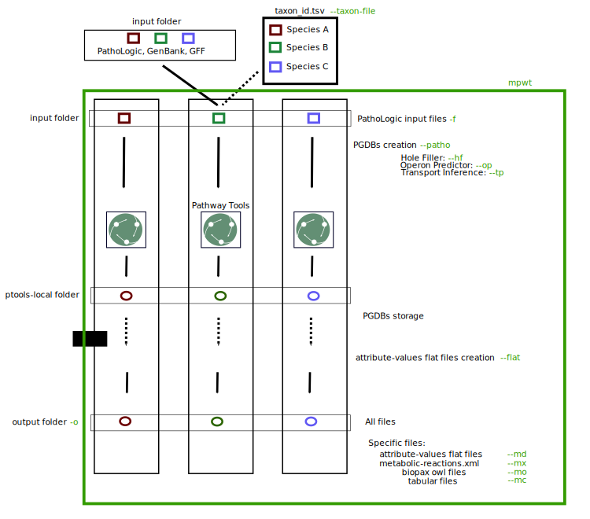

.. image:: https://img.shields.io/pypi/v/mpwt.svg
    :target: https://pypi.python.org/pypi/mpwt

.. image:: https://img.shields.io/badge/doi-10.7554/eLife.61968-blueviolet.svg
    :target: https://doi.org/10.7554/eLife.61968

.. image:: https://img.shields.io/badge/Pathway%20Tools-25.5-brightgreen
    :target: https://bioinformatics.ai.sri.com/ptools/release-notes.html

mpwt: Multiprocessing Pathway Tools
===================================

mpwt is a python package for running Pathway Tools [PathwayToolsarXiv]_ on multiple genomes using multiprocessing. More precisely, it launches one PathoLogic [Karp2011]_ process for each organism (PathoLogic and Pathway Tools pathway prediction are described in this `blog entry <http://pathwaytools.blogspot.com/2020/10/how-does-metabolic-pathway-prediction.html>`__). This allows to increase the speed of draft metabolic network reconstruction when working on multiple organisms.

The last version of Pathway Tools supported by mpwt is shown in the badge named "Pathway Tools".

mpwt: Pipeline summary
======================

The following picture shows the main argument of mpwt:

.. contents:: Table of contents
   :backlinks: top
   :local:

Installation
------------

Requirements
~~~~~~~~~~~~

mpwt needs at least **Python 3.6**.
mpwt requires three python depedencies (`biopython <https://github.com/biopython/biopython>`__ , `chardet <https://github.com/chardet/chardet>`__ and `gffutils <https://github.com/daler/gffutils>`__) and **Pathway Tools**. For the multiprocessing, mpwt uses the `multiprocessing library of Python 3 <https://docs.python.org/3/library/multiprocessing.html>`__.

You must have an environment where Pathway Tools is installed. Pathway Tools can be obtained `here <http://bioinformatics.ai.sri.com/ptools/>`__.

Pathway Tools needs **Blast**, so it must be install on your system. Depending on your system, Pathway Tools needs a file named **.ncbirc** to locate Blast, for more informations look at `this page <http://bioinformatics.ai.sri.com/ptools/installation-guide/released/blast.html>`__.

/!\\ For all OS, Pathway-Tools must be in ``$PATH``.

On Linux and MacOS: ``export PATH=$PATH:/your/install/directory/pathway-tools``.

Consider adding Pathway Tools in ``$PATH`` permanently by using the following command and then sourcing bashrc:

.. code:: sh

    echo 'export PATH="$PATH:/your/install/directory/pathway-tools:"' >> ~/.bashrc
    source ~/.bashrc

If your OS doesn't support Pathway Tools, you can use a docker container. If it's your case, look at `Pathway Tools Multiprocessing Docker <https://github.com/ArnaudBelcour/mpwt-docker>`__.
It is a dockerfile that will create a container with Pathway Tools, its dependencies and this package. You just need to give a Pathway Tools installer as input.

You can also look at `Pathway Tools Multiprocessing Singularity <https://github.com/ArnaudBelcour/mpwt-singularity>`__.
More manipulations are required compared to Docker but with this you can create a Singularity image.

Using pip
~~~~~~~~~

.. code:: sh

    pip install mpwt

Use
---

Input data
~~~~~~~~~~

The script takes a folder containing sub-folders as input. Each sub-folder contains a Genbank/GFF file or multiple PathoLogic Format (PF) files.

.. code-block:: text

    Folder_input
    ├── species_1
    │   └── species_1.gbk
    ├── species_2
    │   └── species_2.gff
    │   └── species_2.fasta
    ├── species_3
    │   └── species_3.gbk
    ├── species_4
    │   └── scaffold_1.pf
    │   └── scaffold_1.fasta
    │   └── scaffold_2.pf
    │   └── scaffold_2.fsa
    ├── taxon_id.tsv
    ..

Input files must have the same name as the folder in which they are located and also finished with a .gbk/.gbff or a .gff (the name must not be only uppercase otherwise this can cause issue with Pathway Tools such as this one: ``Error: Cannot use the organism identifier ORGID as a genetic element ID.``).

For PF files, there is one file for each scaffold/contig and one corresponding fasta file.

Pathway Tools will run on each Genbank/GFF/PF files. It will create the results in the ptools-local folder but you can also choose an output folder.

Genbank
+++++++

.. code-block:: text

    Folder_input
    ├── species_1
    │   └── species_1.gbk
    ..

Genbank file example:

.. code-block:: text

    LOCUS       scaffold1         XXXXXX bp    DNA     linear   INV DD-MMM-YYYY
    DEFINITION  My species genbank.
    ACCESSION   scaffold1
    VERSION     scaffold1
    KEYWORDS    Key words.
    SOURCE      Source
    ORGANISM  Species name
                Taxonomy; Of; My; Species; With;
                The; Genus.
    FEATURES             Location/Qualifiers
        source          1..XXXXXX
                        /scaffold="scaffold1"
                        /db_xref="taxon:taxonid"
        gene            START..STOP
                        /locus_tag="gene1"
        mRNA            START..STOP
                        /locus_tag="gene1"
        CDS             START..STOP
                        /locus_tag="gene1"
                        /db_xref="InterPro:IPRXXXXXX"
                        /go_component="GO:XXXXXXX"
                        /EC_number="X.X.X.X"
                        /translation="AMINOAACIDSSEQUENCE"

Look at the `NCBI GBK format <http://www.insdc.org/files/feature_table.html#7.1.2>`__ for more informations.
You can also look at the `example <http://bioinformatics.ai.sri.com/ptools/sample.gbff>`__ provided on Pathway Tools site.

GFF
+++

.. code-block:: text

    Folder_input
    ├── species_2
    │   └── species_2.gff
    │   └── species_2.fasta
    ..

GFF file example:

.. code-block:: text

    ##gff-version 3
    ##sequence-region scaffold_1 1 XXXXXX
    scaffold_1	RefSeq	region	1	XXXXXXX	.	+	.	ID=region_id;Dbxref=taxon:XXXXXX
    scaffold_1	RefSeq	gene	START	STOP	.	-	.	ID=gene_id
    scaffold_1	RefSeq	CDS	START	STOP	.	-	0	ID=cds_id;Parent=gene_id;ec_number=X.X.X.X"

**Warning**: it seems that metabolic networks from GFF file have less reactions/pathways/compounds than metabolic networks from Genbank file or PathoLogic File.
Lack of some annotations (EC, GO) can be the reason explaining these differences.

Look at the `NCBI GFF format <https://www.ncbi.nlm.nih.gov/genbank/genomes_gff/>`__ for more informations.

You have to provide a nucleotide sequence file (either '.fasta' or '.fsa' extensions) associated with the GFF file containing the chromosome/scaffold/contig sequence.

.. code-block:: text

    >scaffold_1
    ATGATGCTGATACTGACTTAGCAT

PathoLogic Format
+++++++++++++++++

.. code-block:: text

    Folder_input
    ├── species_4
    │   └── scaffold_1.pf
    │   └── scaffold_1.fasta
    │   └── scaffold_2.pf
    │   └── scaffold_2.fsa
    ├── taxon_id.tsv
    ..

PF file example:

.. code-block:: text

    ;;;;;;;;;;;;;;;;;;;;;;;;;
    ;; scaffold_1
    ;;;;;;;;;;;;;;;;;;;;;;;;;
    ID	gene_id
    NAME	gene_id
    STARTBASE	START
    ENDBASE	STOP
    FUNCTION	ORF
    PRODUCT-TYPE	P
    PRODUCT-ID	prot gene_id
    EC	X.X.X.X
    DBLINK	GO:XXXXXXX
    INTRON	START1-STOP1
    //

Look at the `Pathologic format <http://bioinformatics.ai.sri.com/ptools/tpal.pf>`__ for more informations.

You have to provide one nucleotide sequence (either '.fasta' or '.fsa' extension) for each pathologic containing one scaffold/contig. This is optionnal since mpwt 0.7.0.

.. code-block:: text

    >scaffold_1
    ATGATGCTGATACTGACTTAGCAT

You also need to add the taxon ID in the **taxon_id.tsv** (a tsv file with two values: the name of the folder containing the PF files and the taxon ID corresponding).

taxon_id.tsv file
+++++++++++++++++

This tabulated file is required when using PathoLogic Format as input. But it can also bee used to give more informations to Pathway Tools.

A simple file looks like this:

+------------+------------+
|species     |taxon_id    |
+============+============+
|species_4   |4           |
+------------+------------+

If you don't have taxon ID in your Genbank or GFF file, you can add one in this file for the corresponding species.

You can also add more informations for the genetic elements like **circularity of genome** (Y or N), **type of genetic element** (:CHRSM, :PLASMID, :MT (mitochondrial chromosome), :PT (chloroplast chromosome), or :CONTIG) or **codon table** (see the corresponding code below).

You can also specify reference PGDB. This can be useful if you have PGDB with manual curation, especially with reactions or pathways not present in MetaCyc.
These reactions or pathways will be added into MetaCyc before reaction and pathways prediction (if the reactions or pathways are supported by evidence other than computational ones).

Example:

+------------+------------+------------+------------+------------+-------------------+----------------+
|species     |taxon_id    |  circular  |element_type| codon_table| corresponding_file| reference_pgdb |
+============+============+============+============+============+===================+================+
|species_1   |10          |    Y       | :CHRSM     |1           |                   |    pgdb_id     |
+------------+------------+------------+------------+------------+-------------------+----------------+
|species_4   |4           |    N       | :CHRSM     |1           |  scaffold_1       |                |
+------------+------------+------------+------------+------------+-------------------+----------------+
|species_4   |4           |    N       | :MT        |1           |  scaffold_2       |                |
+------------+------------+------------+------------+------------+-------------------+----------------+

As you can see for **PF file** (species_4) you can use the column **corresponding_file** to add information for each PF files.

Genetic code for Pathway Tools:

+--------------------+-----------------------------------------------------------------------------------------------+
|Corresponding number|Genetic code                                                                                   |
+====================+===============================================================================================+
|0                   |Unspecified                                                                                    |
+--------------------+-----------------------------------------------------------------------------------------------+
|1                   | The Standard Code                                                                             |
+--------------------+-----------------------------------------------------------------------------------------------+
|2                   | The Vertebrate Mitochondrial Code                                                             |
+--------------------+-----------------------------------------------------------------------------------------------+
|3                   | The Yeast Mitochondrial Code                                                                  |
+--------------------+-----------------------------------------------------------------------------------------------+
|4                   | The Mold, Protozoan, and Coelenterate Mitochondrial Code and the Mycoplasma/Spiroplasma Code  |
+--------------------+-----------------------------------------------------------------------------------------------+
|5                   |The Invertebrate Mitochondrial Code                                                            |
+--------------------+-----------------------------------------------------------------------------------------------+
|6                   | The Ciliate, Dasycladacean and Hexamita Nuclear Code                                          |
+--------------------+-----------------------------------------------------------------------------------------------+
|9                   | The Echinoderm and Flatworm Mitochondrial Code                                                |
+--------------------+-----------------------------------------------------------------------------------------------+
|10                  | The Euplotid Nuclear Code                                                                     |
+--------------------+-----------------------------------------------------------------------------------------------+
|11                  | The Bacterial, Archaeal and Plant Plastid Code                                                |
+--------------------+-----------------------------------------------------------------------------------------------+
|12                  | The Alternative Yeast Nuclear Code                                                            |
+--------------------+-----------------------------------------------------------------------------------------------+
|13                  |The Ascidian Mitochondrial Code                                                                |
+--------------------+-----------------------------------------------------------------------------------------------+
|14                  | The Alternative Flatworm Mitochondrial Code                                                   |
+--------------------+-----------------------------------------------------------------------------------------------+
|15                  |Blepharisma Nuclear Code                                                                       |
+--------------------+-----------------------------------------------------------------------------------------------+
|16                  | Chlorophycean Mitochondrial Code                                                              |
+--------------------+-----------------------------------------------------------------------------------------------+
|21                  | Trematode Mitochondrial Code                                                                  |
+--------------------+-----------------------------------------------------------------------------------------------+
|22                  |Scenedesmus obliquus Mitochondrial Code                                                        |
+--------------------+-----------------------------------------------------------------------------------------------+
|23                  | Thraustochytrium Mitochondrial Code                                                           |
+--------------------+-----------------------------------------------------------------------------------------------+

Input files created by mpwt
~~~~~~~~~~~~~~~~~~~~~~~~~~~

Three input files are created by mpwt. Informations are extracted from the Genbank/GFF/PF file.
myDBName corresponds to the name of the folder and the Genbank/GFF/PF file.
taxonid corresponds to the taxonid in the db_xref of the source feature in the Genbank/GFF/PF.
The species_name is extracted from the Genbank/GFF/PF files.

.. code-block:: text

    **organism-params.dat**
    ID  myDBName
    STORAGE FILE
    NCBI-TAXON-ID   taxonid
    NAME    species_name

    **genetic-elements.dats**
    NAME    
    ANNOT-FILE  gbk_pathname
    //

    **flat_files_creation.lisp**
    (in-package :ecocyc)
    (select-organism :org-id 'myDBName)
    (let ((*progress-noter-enabled?* NIL))
            (create-flat-files-for-current-kb))

Command Line and Python arguments
~~~~~~~~~~~~~~~~~~~~~~~~~~~~~~~~~

By using the python multiprocessing library, mpwt launches parallel PathoLogic processes on physical cores. Regarding memory requirements, they depend on the genome but we advise to use at least 2 GB per core.

mpwt can be used with the command lines:

.. code:: sh

    mpwt -f=FOLDER [-o=FOLDER] [--patho] [--hf] [--op] [--tp] [--nc] [--flat] [--md] [--mx] [--mo] [--mc] [-p=FLOAT] [--cpu=INT] [-r] [-v] [--clean] [--log=FOLDER] [--taxon-file]
    mpwt --flat [-f=FOLDER] [-o=FOLDER] [--md] [--mx] [--mo] [--mc] [--cpu=INT] [-v]
    mpwt -o=FOLDER [--md] [--mx] [--mo] [--mc] [--cpu=INT] [-v]
    mpwt --clean [--cpu=INT] [-v]
    mpwt --delete=STR [--cpu=INT]
    mpwt --list
    mpwt --version
    mpwt topf -f=FOLDER -o=FOLDER [--cpu=INT] [--clean]

Optional argument are identified by [].

mpwt can be used in a python script with an import:

.. code:: python

    import mpwt

    folder_input = "path/to/folder/input"
    folder_output = "path/to/folder/output"

    mpwt.multiprocess_pwt(input_folder=folder_input,
              output_folder=folder_output,
              patho_inference=optional_boolean,
              patho_hole_filler=optional_boolean,
              patho_operon_predictor=optional_boolean,
              patho_transporter_inference=patho_transporter_inference,
              no_download_articles=optional_boolean,
              flat_creation=optional_boolean,
              dat_extraction=optional_boolean,
              xml_extraction=optional_boolean,
              owl_extraction=optional_boolean,
              col_extraction=optional_boolean,
              size_reduction=optional_boolean,
              number_cpu=int,
              patho_log=optional_folder_pathname,
              pathway_score=pathway_score,
              taxon_file=optional_str,
              verbose=optional_boolean,
              permission=optional_str)

+-------------------------+------------------------------------------------+-------------------------------------------------------------------------+
| Command line argument   | Python argument                                | description                                                             |
+=========================+================================================+=========================================================================+
|          -f             | input_folder(string: folder pathname)          | Input folder as described in Input data                                 |
+-------------------------+------------------------------------------------+-------------------------------------------------------------------------+
|          -o             | output_folder(string: folder pathname)         | Output folder containing PGDB data or flat files (see --flat arguments) |
+-------------------------+------------------------------------------------+-------------------------------------------------------------------------+
|          --patho        | patho_inference(boolean)                       | Launch PathoLogic inference on input folder                             |
+-------------------------+------------------------------------------------+-------------------------------------------------------------------------+
|          --hf           | patho_hole_filler(boolean)                     | Launch PathoLogic Hole Filler with Blast                                |
+-------------------------+------------------------------------------------+-------------------------------------------------------------------------+
|          --op           | patho_operon_predictor(boolean)                | Launch PathoLogic Operon Predictor                                      |
+-------------------------+------------------------------------------------+-------------------------------------------------------------------------+
|          --tp           | patho_transporter_inference(boolean)           | Launch PathoLogic Transport Inference Parser                            |
+-------------------------+------------------------------------------------+-------------------------------------------------------------------------+
|          --nc           | no_download_articles(boolean)                  | Launch PathoLogic without loading PubMed citations (**not working**)    |
+-------------------------+------------------------------------------------+-------------------------------------------------------------------------+
|          -p             | pathway_score(float)                           | Launch PathoLogic using a specified pathway prediction score cutoff     |
+-------------------------+------------------------------------------------+-------------------------------------------------------------------------+
|          --flat         | flat_creation(boolean)                         | Create BioPAX/attribute-value flat files                                |
+-------------------------+------------------------------------------------+-------------------------------------------------------------------------+
|          --md           | dat_extraction(boolean)                        | Move the dat files into the output folder                               |
+-------------------------+------------------------------------------------+-------------------------------------------------------------------------+
|          --mx           | xml_extraction(boolean)                        | Move the metabolic-reactions.xml file into the output folder            |
+-------------------------+------------------------------------------------+-------------------------------------------------------------------------+
|          --mo           | owl_extraction(boolean)                        | Move owl files into the output folder                                   |
+-------------------------+------------------------------------------------+-------------------------------------------------------------------------+
|          --mc           | col_extraction(boolean)                        | Move tabular files into the output folder                               |
+-------------------------+------------------------------------------------+-------------------------------------------------------------------------+
|          --cpu          | number_cpu(int)                                | Number of cpu used for the multiprocessing                              |
+-------------------------+------------------------------------------------+-------------------------------------------------------------------------+
|          -r             | size_reduction(boolean)                        | Delete PGDB in ptools-local to reduce size and return compressed files  |
+-------------------------+------------------------------------------------+-------------------------------------------------------------------------+
|          --log          | patho_log(string: folder pathname)             | Folder where log files for PathoLogic inference will be store           |
+-------------------------+------------------------------------------------+-------------------------------------------------------------------------+
|          --delete       | mpwt.remove_pgdbs(string: pgdb name)           | Delete a specific PGDB                                                  |
+-------------------------+------------------------------------------------+-------------------------------------------------------------------------+
|          --clean        | mpwt.cleaning()                                | Delete all PGDBs in ptools-local folder or only PGDB from input folder  |
+-------------------------+------------------------------------------------+-------------------------------------------------------------------------+
|     --taxon-file        | taxon_file(string: file pathanme)              | Force mpwt to use the taxon ID in the taxon_id.tsv file                 |
+-------------------------+------------------------------------------------+-------------------------------------------------------------------------+
|     --permission        | permission(string: 'all', 'group')             | Choose permission access to PGDB in ptools-local and output files       |
+-------------------------+------------------------------------------------+-------------------------------------------------------------------------+
|          -v             | verbose(boolean)                               | Print some information about the processing of mpwt                     |
+-------------------------+------------------------------------------------+-------------------------------------------------------------------------+

There is also another argument:

.. code:: sh

    mpwt topf -f input_folder -o output_folder --cpu cpu_number

.. code:: python

    import mpwt
    mpwt.to_pathologic.create_pathologic_file(input_folder, output_folder, cpu_number)

This argument reads the input data inside the input folder. Then it converts Genbank and GFF files into PathoLogic Format files. And if there is already PathoLogic files it copies them.

It can be used to avoid issues with parsing Genbank and GFF files. But it is an early Work in Progress as at this moment the PathoLogic files created do not produce the same PGDB as the corresponding GenBank/GFF files.
Especially some genes are missing in th PGDB.

PathoLogic Hole Filler
++++++++++++++++++++++

The --hf/patho_hole_filler option uses the Hole Filler [Karp2019arXiv]_:

    The pathway hole-filling program PHFiller (a component of PathoLogic) generates hypotheses as to which genes code for these missing enzymes by using the following method. Given a reaction that is a pathway hole, the program first queries the UniProt database to find all known sequences for enzymes that catalyze that same reaction in other organisms. The program then uses the BLAST tool to compare that set of sequences against the full proteome of the organism in which we are seeking hole fillers. It scores the resulting BLAST hits using a Bayesian classifier that considers information such as genome localization (that is, is a potential hole filler in the same operon as another gene in the same metabolic pathway?). At a stringent probability-score cutoff, our method finds potential hole fillers for approximately 45% of the pathway holes in a microbial genome [59].

This option is more precisely described in [Green2004]_:

1. Sequence retrieval – Retrieve from Swiss-Prot and PIR sequences for enzymes that catalyze the desired reaction in other organisms. Because these sequences are not necessarily homologs, we will refer to enzymes with the same function in a variety of organisms as isozymes. For Swiss-Prot, the program retrieves Swiss-Prot IDs directly from the ENZYME database. For PIR sequences, the program retrieves IDs from the MetaCyc PGDB. Sequences are then retrieved directly from the most recent version of each database.

2. Homology search – BLAST each query isozyme sequence against the genome of the organism of interest.

3. Data consolidation – Congruence analysis of the resulting BLAST hits to consolidate data reported for sequences that align with one or more query isozymes.

4. Candidate evaluation – Determine the probability that each candidate protein has the activity required by the missing reaction.

Operon Predictor
++++++++++++++++

The --op/patho_operon_predictor identifies operon [Karp2019arXiv]_:

    The Pathway Tools operon predictor identifies operon boundaries by examining pairs of adjacent genes A and B and using information such as intergenic distance, and whether it can identify a functional relationship between A and B, such as membership in the same pathway, membership in the same multimeric protein complex, or whether A is a transporter for a substrate within a metabolic pathway in which B is an enzyme.

Transport Inference
+++++++++++++++++++

The --tp/patho_transporter_inference tries to answer the question "What chemicals can the organism import or export?" [Karp2019arXiv]_:

    To answer such queries, Pathway Tools uses an ontology-based representation of transporter function in which transport events are represented as reactions in which the transported compound(s) are substrates. Each substrate is labeled with the cellular compartment in which it resides, and each substrate is a controlled-vocabulary term from the extensive set of chemical compounds in MetaCyc. The TIP program converts the free-text descriptions of transporter functions found in genome annotations (examples: “phosphate ABC transporter”and “sodium/proline symporter”) into computable transport reactions.

Pathway prediction score cutoff
+++++++++++++++++++++++++++++++

The -p/pathway_score determines the cutoff for pathway prediction.

This cutoff is defined in ptools-init.dat:

    During the pathway prediction process, pathways are assigned a score between 0 and 1 based on the evidence for the presence of that pathway.
    Pathways whose score does not exceed this cutoff value will usually be rejected (although certain rules may cause them to be predicted as present).

This pathway prediction score has also been explained in [Karp2018]_:

    A very strict pathway score cutoff of 1.0 was supplied to PathoLogic to predict into BlongCyc (from MetaCyc) only the pathways that have gene annotations associated with all pathway reactions, to minimize the effects of pathway inference on biomass goal reachability.
    PathoLogic inference of a metabolic pathway causes all reactions within the pathway to be imported from the MetaCyc database into the new PGDB, including reactions lacking gene assignments — using the 1.0 cutoff means that no reactions lacking gene assignments were imported from MetaCyc during pathway inference.
    The resulting PGDB was subjected to the following manual refinement steps. That is, some manual refinement occurred before gap filling began.

Examples
~~~~~~~~

Possible uses of mpwt:

..

    .. code:: sh

        command line

    .. code:: python

        import mpwt
        python script

Create PGDBs of studied organisms inside ptools-local:

..

    .. code:: sh

        mpwt -f path/to/folder/input --patho

    .. code:: python

        import mpwt
        mpwt.multiprocess_pwt(input_folder='path/to/folder/input',
                patho_inference=True)

Convert Genbank and GFF files into PathoLogic files then create PGDBs of studied organisms inside ptools-local:

..

    .. code:: sh

        mpwt topf -f path/to/folder/input -o path/to/folder/pf
        mpwt -f path/to/folder/pf --patho

    .. code:: python

        import mpwt
        mpwt.create_pathologic_file(input_folder='path/to/folder/input', output_folder='path/to/folder/pf')
        mpwt.multiprocess_pwt(input_folder='path/to/folder/pf', patho_inference=True)

Create PGDBs of studied organisms inside ptools-local with Hole Filler, Operon Predictor, Transport Inference Parser and create logs:

..

    .. code:: sh

        mpwt -f path/to/folder/input --patho --hf --op --tp --log path/to/folder/log

    .. code:: python

        import mpwt
        mpwt.multiprocess_pwt(input_folder='path/to/folder/input',
                patho_inference=True,
                patho_hole_filler=True,
                patho_operon_predictor=True,
                patho_transporter_inference=True,
                patho_log='path/to/folder/log')

Create PGDBs of studied organisms inside ptools-local with pathway prediction score of 1:

..

    .. code:: sh

        mpwt -f path/to/folder/input --patho -p 1.0

    .. code:: python

        import mpwt
        mpwt.multiprocess_pwt(input_folder='path/to/folder/input',
                            patho_inference=True,
                            pathway_score=1.0)

Create PGDBs of studied organisms inside ptools-local and create flat files:

..

    .. code:: sh

        mpwt -f path/to/folder/input --patho --flat

    .. code:: python

        import mpwt
        mpwt.multiprocess_pwt(input_folder='path/to/folder/input',
                            patho_inference=True,
                            flat_creation=True)

Create PGDBs of studied organisms inside ptools-local.
Then move all the PGDB files to the output folder.

..

    .. code:: sh

        mpwt -f path/to/folder/input --patho -o path/to/folder/output

    .. code:: python

        import mpwt
        mpwt.multiprocess_pwt(input_folder='path/to/folder/input',
                            output_folder='path/to/folder/output',
                            patho_inference=True)

Create PGDBs of studied organisms inside ptools-local and create flat files.
Then move the dat files to the output folder.

..

    .. code:: sh

        mpwt -f path/to/folder/input --patho --flat -o path/to/folder/output --md

    .. code:: python

        import mpwt
        mpwt.multiprocess_pwt(input_folder='path/to/folder/input',
                            output_folder='path/to/folder/output',
                            patho_inference=True,
                            flat_creation=True,
                            dat_extraction=True)

Create flat files for the PGDB inside ptools-local.
And move them to the output folder.

..

    .. code:: sh

        mpwt --flat -o path/to/folder/output --md

    .. code:: python

        import mpwt
        mpwt.multiprocess_pwt(output_folder='path/to/folder/output',
                            flat_creation=True,
                            dat_extraction=True)

Move PGDB from ptools-local to the output folder:

..

    .. code:: sh

        mpwt -o path/to/folder/output

    .. code:: python

        import mpwt
        mpwt.multiprocess_pwt(output_folder='path/to/folder/output')

Move dat files from ptools-local to the output folder:

..

    .. code:: sh

        mpwt -o path/to/folder/output --md

    .. code:: python

        import mpwt
        mpwt.multiprocess_pwt(output_folder='path/to/folder/output',
                dat_extraction=True)

Useful functions
~~~~~~~~~~~~~~~~

- Run the multiprocess Pathway Tools on input folder

..

    .. code:: python

        import mpwt
        mpwt.multiprocess_pwt(input_folder=folder_input,
                output_folder=folder_output,
                patho_inference=optional_boolean,
                patho_hole_filler=optional_boolean,
                patho_operon_predictor=optional_boolean,
                patho_transporter_inference=patho_transporter_inference,
                no_download_articles=optional_boolean,
                flat_creation=optional_boolean,
                dat_extraction=optional_boolean,
                xml_extraction=optional_boolean,
                owl_extraction=optional_boolean,
                col_extraction=optional_boolean,
                size_reduction=optional_boolean,
                number_cpu=int,
                patho_log=optional_folder_pathname,
                pathway_score=pathway_score,
                taxon_file=optional_str,
                verbose=optional_boolean,
                permission=optional_str)

- Delete all the previous PGDB and the metadata files

..

    .. code:: python

        import mpwt
        mpwt.cleaning(number_cpu=optional_int, verbose=optional_boolean)

    This can also be used with a command line argument:

    .. code:: sh

        mpwt --clean

    If you use ``--clean`` with the argument ``-f input_folder``, it will delete input files ('flat_files_creation.lisp', 'flat_files_creation.log', 'pathologic.log', 'pwt_terminal.log', 'genetic-elements.dat' and 'organism-params.dat') and the PGDB corresponding to the input folder.

    .. code:: sh

        mpwt -f input_folder --clean

    For example if you have:

    .. code-block:: text

        Folder_input
        ├── species_1
        │   └── species_1.gbk
        ├── species_2
        │   └── species_2.gff
        │   └── species_2.fasta
        ├── species_3
        │   └── species_3.gbk

    And you have in your ptools-local:

    .. code-block:: text

        ptools-local
        ├── pgdbs
            ├── user
                ├── species_1cyc
                │   └── ..
                ├── species_2cyc
                │   └── ..
                ├── species_3cyc
                │   └── ..
                ├── species_4cyc
                │   └── ..

    The command:

    .. code:: sh

        mpwt -f input_folder --clean

    will delete species_1cyc, species_2cyc and species_3cyc but not species_4cyc.

- Delete a specific PGDB

..

    With this command, it is possible to delete a specific PGDB, where pgdb_name is the name of the PGDB (ending with 'cyc'). It can be multiple pgdbs, to do this, put all the pgdb IDs in a string separated by  a ','.

    .. code:: python

        import mpwt
        mpwt.remove_pgdbs(pgdb_name)

    And as a command line:

    .. code:: sh

        mpwt --delete mydbcyc1,mydbcyc2

- Return the path of ptools-local

..

    .. code:: python

        import mpwt
        ptools_local_path = mpwt.find_ptools_path()

- Return a list containing all the PGDBs inside ptools-local folder

..

    .. code:: python

        import mpwt
        list_of_pgdbs = mpwt.list_pgdb()

    Can be used as a command with:

    .. code:: sh

        mpwt --list

Errors
~~~~~~

If you encounter errors (and it is highly possible) there is informations that can help you resolved them.

For error during PathoLogic inference, you can use the log arguments.
The log contains the summary of the build and the error for each species.
There is also a pathologic.log (created by Pathway Tools), a pwt_terminal.log (log of the terminal during PathoLogic process) and a flat_files_creation.log (log of the terminal during attributes-values files creation) in each sub-folders.

If the build passed you have also the possibility to see the result of the inference with the file resume_inference.tsv.
For each species, it contains the number of genes/proteins/reactions/pathways/compounds in the metabolic network.

If Pathway Tools crashed, mpwt can print some useful information in verbose mode.
It will show the terminal in which Pathway Tools has crashed.
Also, if there is an error in pathologic.log, it will be shown after **=== Error in Pathologic.log ===**.

There is a `Pathway Tools forum <https://ask.pathwaytools.com/questions/>`__ where you can find informations on Pathway Tools errors.

Output
~~~~~~

If you did not use the output argument, results (PGDB with/without BioPAX/flat files) will be inside your ptools-local folder ready to be used with Pathway Tools.
Have in mind that mpwt does not create the cellular overview. So if you want these results you should run them after.

The different file formats created are described on `Pathway Tools data-file format site <https://bioinformatics.ai.sri.com/ptools/flatfile-format.html>`__.

If you use the output argument, mpwt will copy each of the PGDB folders to the output folder:

.. code-block:: text

    Folder_output
    ├── species_1
    │   └── default-version
    │   └── 1.0
    │       └── data
    │           └── contains BioPAX/flat files if you used the --flat/flat_creation option.
    │       └── input
    │           └── species_1.gbk
    │           └── genetic-elements.dat
    │           └── organism-init.dat
    │           └── organism.dat
    │       └── kb
    │           └── species_1.ocelot
    │       └── reports
    │           └── contains Pathway Tools reports.
    ├── species_2
    ..
    ├── species_3
    ..

If you want specific files, you can use the ``--mX/XXX_extraction`` options.

- ``--md/dat_extraction`` will only copy the attribute-values dat files:

.. code-block:: text

    Folder_output
    ├── species_1
    │   └── classes.dat
    │   └── compounds.dat
    │   └── dnabindsites.dat
    │   └── enzrxns.dat
    │   └── genes.dat
    │   └── pathways.dat
    │   └── promoters.dat
    │   └── protein-features.dat
    │   └── proteins.dat
    │   └── protligandcplxes.dat
    │   └── pubs.dat
    │   └── reactions.dat
    │   └── regulation.dat
    │   └── regulons.dat
    │   └── rnas.dat
    │   └── species.dat
    │   └── terminators.dat
    │   └── transunits.dat
    │   └── ..
    ├── species_2
    ..
    ├── species_3
    ..

- ``--mx/xml_extraction`` will only copy the metabolic-reactions.xml file of each PGDB (created by MetaFlux) and rename it:

.. code-block:: text

    Folder_output
    ├── species_1.xml
    ├── species_2.xml
    ├── species_3.xml
    ..

- ``--mo/owl_extraction`` will only copy the biopax-level2.owl and the biopax-level3.owl files of each PGDB and rename them:

.. code-block:: text

    Folder_output
    ├── species_1-level2.owl
    ├── species_1-level3.owl
    ├── species_2-level2.owl
    ├── species_2-level3.owl
    ├── species_3-level2.owl
    ├── species_3-level3.owl
    ..

- ``--mc/col_extraction`` will only copy the tabular files of each PGDB:

.. code-block:: text

    Folder_output
    ├── species_1
    │   └── enzymes.col
    │   └── genes.col
    │   └── pathways.col
    │   └── protcplxs.col
    │   └── transporters.col
    ├── species_2
    ..
    ├── species_3
    ..

It is also possible to use a combination of these arguments:

.. code:: sh

    mpwt -f input_folder -o output_folder --patho --flat --md --mx --mo --mc

.. code-block:: text

    Folder_output
    ├── species_1
    │   └── biopax-level2.owl
    │   └── biopax-level3.owl
    │   └── classes.dat
    │   └── compounds.dat
    │   └── dnabindsites.dat
    │   └── enzrxns.dat
    │   └── enzymes.col
    │   └── genes.col
    │   └── genes.dat
    │   └── metabolic-reactions.xml
    │   └── pathways.col
    │   └── pathways.dat
    │   └── promoters.dat
    │   └── protcplxs.col
    │   └── protein-features.dat
    │   └── proteins.dat
    │   └── protligandcplxes.dat
    │   └── pubs.dat
    │   └── reactions.dat
    │   └── regulation.dat
    │   └── regulons.dat
    │   └── rnas.dat
    │   └── species.dat
    │   └── terminators.dat
    │   └── transporters.col
    │   └── transunits.dat
    │   └── ..
    ├── species_2
    ..
    ├── species_3
    ..

By using the ``-r /size_reduction`` argument, you will have compressed zip files (and PGDBs inside ptools-local will be deleted):

.. code-block:: text

    Folder_output
    ├── species_1.zip
    ├── species_2.zip
    ├── species_3.zip
    ..

For developer
-------------

mpwt uses logging so you need to create the handler configuration if you want mpwt's log in your application:

.. code:: python

    import logging

    from mpwt import multiprocess_pwt

    logging.basicConfig()

    multiprocess_pwt(...)

Release Notes
-------------

Changes between version are listed on the `release page <https://github.com/AuReMe/mpwt/releases>`__.

Bibliography
------------

.. [Green2004] Green, M.L., Karp, P.D. A Bayesian method for identifying missing enzymes in predicted metabolic pathway databases. BMC Bioinformatics 5, 76 (2004). https://doi.org/10.1186/1471-2105-5-76

.. [Karp2011] Karp, P. D., Latendresse, M., & Caspi, R. The pathway tools pathway prediction algorithm. Standards in genomic sciences 5(3), 424–429 (2011). https://doi.org/10.4056/sigs.1794338

.. [Karp2018] Karp, P. D., Weaver, D. & Latendresse, M. How accurate is automated gap filling of metabolic models?. BMC Systems Biology 12(1), 73 (2018). https://doi.org/10.1186/s12918-018-0593-7

.. [Karp2019arXiv] Karp, P. D., Paley, S. M., Midford, P. E., Krummenacker, M., Billington, R., Kothari, A., Ong, W. K., Subhraveti, P., Keseler, I. M. & Caspi R. Pathway Tools version 23.0: Integrated Software for Pathway/Genome Informatics and Systems Biology. arXiv (2019). https://arxiv.org/abs/1510.03964v3

.. [PathwayToolsarXiv] Karp, P. D., Paley, S. M., Midford, P. E., Krummenacker, M., Billington, R., Kothari, A., Ong, W. K., Subhraveti, P., Keseler, I. M. & Caspi R. Pathway Tools: Integrated Software for Pathway/Genome Informatics and Systems Biology. arXiv. https://arxiv.org/abs/1510.03964

Citation
--------

Belcour* A, Frioux* C, Aite M, Bretaudeau A, Hildebrand F, Siegel A. Metage2Metabo, microbiota-scale metabolic complementarity for the identification of key species. eLife 2020, 9, e61968 `https://doi.org/10.7554/eLife.61968 <https://doi.org/10.7554/eLife.61968>`__.

``mpwt`` depends on the following tools:

- ``Pathway Tools`` for the reconstruction of draft metabolic networks (the article can be not up-to-date, look at the `Publications <https://biocyc.org/publications.shtml>`__ on the BioCyc site):

Karp P D, Midford P E, Billington R, Kothari A, Krummenacker M, Latendresse M, Ong W K, Subhraveti P, Caspi R, Fulcher C, Keseler I M, Paley SM. Pathway Tools version 23.0 update: software for pathway/genome informatics and systems biology. Briefings in Bioinformatics 2021, 22, 109–126 `https://doi.org/10.1093/bib/bbz104 <https://doi.org/10.1093/bib/bbz104>`__.

- ``Biopython`` for GenBank parsing:

Cock, P.J.A., Antao, T., Chang, J.T., Chapman, B.A., Cox, C.J., Dalke, A., Friedberg, I., Hamelryck, T., Kauff, F., Wilczynski, B., de Hoon, M.J.L. Biopython: freely available Python tools for computational molecular biology and bioinformatics. Bioinformatics 2009, 25, 1422–1423 `https://doi.org/10.1093/bioinformatics/btp163 <https://doi.org/10.1093/bioinformatics/btp163>`__.

- ``gffutils`` for GFF parsing:

GitHub repository: `https://github.com/daler/gffutils <https://github.com/daler/gffutils>`__

- ``chardet`` for character encoding detection:

GitHub repository: `https://github.com/chardet/chardet <https://github.com/chardet/chardet>`__

Acknowledgements
----------------

`Mézaine Aite <https://github.com/mezianeAITE>`__ for his work on the first draft of this package.

`Clémence Frioux <https://github.com/cfrioux>`__ for her work and feedbacks.

Peter Karp, Suzanne Paley, Markus Krummenacker, Richard Billington and Anamika Kothari from the `Bioinformatics Research Group of SRI International <http://bioinformatics.ai.sri.com/>`__ for their help on Pathway Tools and on Genbank format.

GenOuest bioinformatics (https://www.genouest.org/) core facility for providing the computing infrastructure to test this tool.

All the users that have tested this tool.
